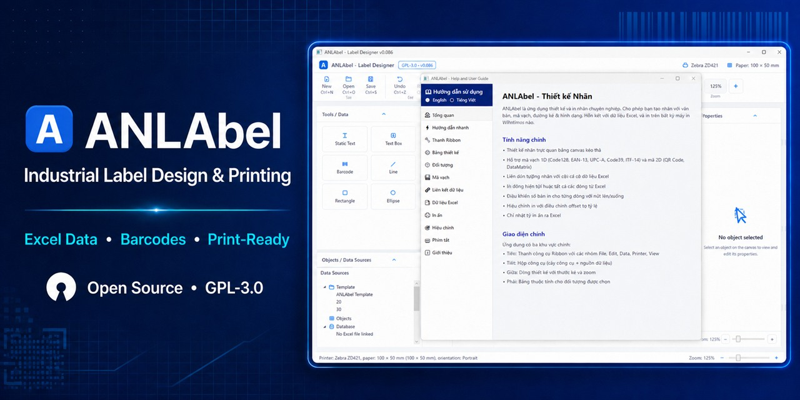

# ANLAbel



<p align="center">
  <strong>Open-source Windows software for designing and printing industrial labels from real production data.</strong>
</p>

<p align="center">
  <a href="https://github.com/ducancdt/anlabel/releases/latest">Download for Windows</a>
  · <a href="docs/quick-start.md">Quick start</a>
  · <a href="https://github.com/ducancdt/anlabel/issues/new/choose">Report an issue</a>
  · <a href="https://github.com/ducancdt/anlabel/discussions">Join the discussion</a>
</p>

<p align="center">
  <a href="https://github.com/ducancdt/anlabel/actions/workflows/ci.yml"></a>
  <a href="LICENSE"></a>
  <a href="https://github.com/ducancdt/anlabel/releases/latest"></a>
  <a href="https://github.com/ducancdt/anlabel/stargazers"></a>
</p>

ANLAbel is a C#/.NET 8 WPF application for manufacturing, warehouse, traceability, quality-control, and product-identification workflows. It combines a visual label designer, Excel-driven variable data, industrial barcode support, print preflight, and millimeter-accurate output in one focused desktop tool.

## Why ANLAbel

- **Design visually:** arrange text, images, shapes, lines, tables, barcodes, QR Code, Data Matrix, Aztec, and PDF417 on a millimeter-based canvas.
- **Connect production data:** import Excel sheets, preview headers, bind fields, apply formulas, and track printed rows.
- **Print with confidence:** validate missing data, bounds, stale sources, barcode module size, label orientation, and physical printer DPI before printing.
- **Work with industrial printers:** target Windows drivers used with Zebra, TSC, Godex, SATO, Argox, Honeywell, Intermec, Citizen, and Toshiba TEC devices.
- **Keep workflows portable:** save readable `.anlabel` JSON templates and reuse generic templates from the built-in library.
- **Audit output:** retain append-only CSV print history and export reports to Excel.

## Get started

1. Download the [latest Windows x64 installer](https://github.com/ducancdt/anlabel/releases/latest).
2. Install and open ANLAbel. The Full build has no trial period, activation step, or license key.
3. Choose a label size or open a template.
4. Add static content, barcodes, and variable fields.
5. Import your Excel data, preview records, select your printer, and run Print Preview.

See the detailed workflow notes in the [quick-start guide](docs/quick-start.md).

> The installer is currently unsigned. Windows SmartScreen may display a warning on first launch. Verify that the download comes from this repository's Releases page.

## Documentation and design references

- [Roadmap](ROADMAP.md) — high-level priorities and contribution directions.
- [Master plan](MASTER_PLAN.md) — product history and release narrative.
- [Detailed plan](PLAN.md) — chronological implementation notes and regression gates.
- [Continuation handoff](docs/reinvention/10-continuation-handoff-2026-08-13.md) — current documentation reconciliation queue and ownership boundary.
- [Security policy](SECURITY.md) — private vulnerability reporting and handling guidance.

The optional [ANLAbel shell reference in Figma](https://www.figma.com/design/zdN71qfzrYV6pPt1b2FRRc/ANLAbel-%E2%80%94-NiceLabel-Shell-Recreation) and [frequency-first panels exploration](https://www.figma.com/design/kqyNBI0DgRHnPzJTDBIui5) are visual research references. A Figma frame does not replace WPF runtime screenshots, regression coverage, or physical-printer evidence.

## Supported environment

- Windows 10 or Windows 11, x64.
- A Windows-compatible industrial label-printer driver for physical printing.
- 203, 300, and 600 DPI label workflows.
- Visual Studio 2022 or a compatible .NET SDK when building from source.

## Build from source

```powershell
git clone https://github.com/ducancdt/anlabel.git
cd anlabel
dotnet restore ANLAbel.slnx
dotnet build ANLAbel.slnx -c Release --no-restore
dotnet run --project src/ANLAbel.App/ANLAbel.App.csproj -c Release
```

## Tests

```powershell
dotnet run --project src/ANLAbel.Tests/ANLAbel.Tests.csproj -c Release
dotnet test src/ANLAbel.UnitTests/ANLAbel.UnitTests.csproj -c Release
```

The repository includes application-level regression tests and xUnit tests covering data import, template persistence, barcode rendering, print geometry, DPI conversion, preflight validation, licensing policy, and reliability cases.

## Community

- Read [CONTRIBUTING.md](CONTRIBUTING.md) before proposing a change.
- Use the issue forms for reproducible bugs and feature requests.
- Use [GitHub Discussions](https://github.com/ducancdt/anlabel/discussions) for setup questions, printer compatibility notes, and ideas.
- Review the [roadmap](ROADMAP.md) to find useful areas for testing and contribution.
- Report vulnerabilities privately using [SECURITY.md](SECURITY.md).

If ANLAbel solves a real labeling problem for you, consider starring the repository and sharing the release with another manufacturing or warehouse team. Printer compatibility reports are especially valuable.

## License

ANLAbel source code is licensed under the [GNU General Public License v3.0 only](LICENSE) (`GPL-3.0-only`). You may use, study, modify, and redistribute the software under the conditions of that license. Distributed modified versions must preserve the GPL terms and provide the corresponding source code.

Third-party libraries and assets retain their respective licenses. See [docs/license-notices.md](docs/license-notices.md) for notices.

Copyright (c) 2026 Duc An.
