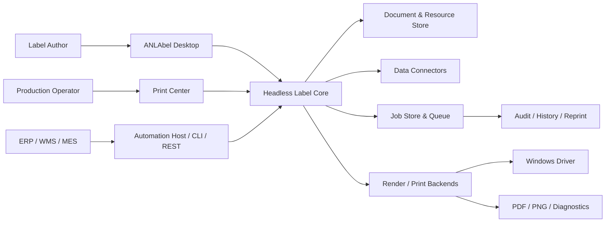

# Kiến trúc đích ANLAbel Next

## 1. Mục tiêu kiến trúc

Kiến trúc đích phải giải quyết đồng thời năm vấn đề:

1. designer, preview và print không còn khác semantic;
2. UI không còn là nơi chứa document rules và orchestration;
3. template có thể migrate, diff, audit và chạy headless;
4. data, printer và job đều là dependency explicit;
5. có thể cải tiến từng phần mà vẫn release được.

## 2. Context tổng thể



Desktop là một client của core, không phải core. Cùng một compiler phải chạy được từ UI, tests và headless host.

## 3. Pipeline chuẩn

### 3.1 Edit pipeline

```text
Pointer/Keyboard/Inspector
  → Editor Intent
  → Command Transaction
  → Validate mutation invariants
  → New DocumentSnapshot
  → Incremental Scene Compile
  → Viewport projection + Problems
```

UI chỉ phát intent. Command handler là nơi duy nhất thay document. Scene compile không mutate document.

### 3.2 Print pipeline

```text
Published DocumentRevision
  + DataSnapshot
  + PrinterProfileSnapshot
  + JobOptions
  → Resolve variables/conditions/layout/fonts/barcodes
  → Immutable ResolvedScene / RenderPlan
  → Preflight
  → Job Manifest + idempotency decision
  → Dispatch backend
  → Spool/Device feedback
  → Final job event
```

Preview của job phải dùng đúng `ResolvedScene` đã preflight. Nếu profile/data/document đổi, snapshot cũ không tự đổi.

## 4. Bounded contexts

### Document

Chứa schema, artboards, layers, nodes, styles, resources, variables, conditions và metadata. Không reference WPF, DataTable, PrintQueue hoặc file dialog.

### Editor

Chứa selection model, commands, transactions, undo/redo, clipboard, alignment và transform gestures. Editor state không persisted vào document trừ khi command tạo mutation rõ ràng.

### Scene Compiler

Resolve document + data + profile thành scene bất biến. Chứa layout, text shaping contract, barcode geometry, conditions, resource resolution và diagnostics.

### Data

Connection, schema, typed record, transform graph, sample fixture và secrets reference. Excel là một connector.

### Printing

Printer registry/profile, capability snapshot, preflight, job manifest, queue, dispatch, feedback, calibration và reprint.

### Repository/Governance

Document revision, resource hash, draft/published state, semantic/visual diff, comments, approval và retention.

### Automation

Trigger, decoder, map, validate, compile, dispatch, acknowledge; deployment và run logs.

## 5. Cấu trúc solution đề xuất

Không tạo tất cả project ngay lập tức. Bắt đầu bằng namespace/folder boundary, chỉ tách assembly khi dependency graph và test isolation chứng minh lợi ích.

```text
src/
  ANLAbel.Core/                 # compatibility + shared primitives trong migration
  ANLAbel.Document/             # document v2, migrations, resources, revisions
  ANLAbel.Editor/               # commands, transactions, selection, geometry operations
  ANLAbel.Scene/                # compiler, layout, resolved scene, diagnostics
  ANLAbel.Rendering.Wpf/        # viewport/preview adapter
  ANLAbel.Printing/             # profile, preflight, jobs, Windows backend
  ANLAbel.Data/                 # connector contracts + Excel adapter
  ANLAbel.Automation/           # headless pipeline (khi tới phase)
  ANLAbel.Infrastructure/       # SQLite/filesystem/OS implementations
  ANLAbel.App/                  # WPF shell/workspaces, composition root
tests/
  ANLAbel.Document.Tests/
  ANLAbel.Editor.Tests/
  ANLAbel.Scene.Tests/
  ANLAbel.Printing.Tests/
  ANLAbel.UiTests/
  Fixtures/
```

Trong R1 có thể dùng project hiện tại và thêm folder/contract trước để tránh project explosion.

## 6. Document v2

### 6.1 Envelope

```json
{
  "format": "anlabel.document",
  "schemaVersion": 2,
  "documentId": "uuid",
  "revisionId": "content-or-revision-id",
  "createdUtc": "...",
  "modifiedUtc": "...",
  "metadata": {},
  "media": {},
  "resources": [],
  "variables": [],
  "artboards": [],
  "layers": [],
  "nodes": [],
  "sampleData": {},
  "dependencies": {}
}
```

### 6.2 Node contract

Mọi node có:

- `id`, `kind`, `name`;
- parent/layer/artboard;
- transform và local bounds theo canonical physical unit;
- style ref/inline style;
- visibility/print condition;
- data bindings;
- accessibility/description metadata;
- extension bag có namespace cho forward compatibility.

Node types đích:

- text, text frame, image, barcode, shape, line;
- group, component instance;
- absolute layer;
- stack/grid/table/repeat region;
- conditional container;
- guide/non-printing annotation.

### 6.3 Unit

Public API vẫn dùng millimeter để người dùng hiểu. Internally document v2 nên đánh giá fixed-point micrometer hoặc decimal để giảm drift qua nhiều transaction. Quyết định cuối cần benchmark serialization, transform và backward compatibility; không đổi vội chỉ vì double “không đẹp”.

### 6.4 Resources

Mỗi resource có:

- stable ID;
- media type;
- content hash;
- embed/link policy;
- original/display name;
- optional URI relative;
- size và security classification.

Font requirement phải là resource dependency dù không embed font vì licensing.

### 6.5 Migration

- Reader nhận mọi version còn support.
- Migrate theo chuỗi `v1 → v2 → v3`, mỗi bước pure và idempotent.
- Save mặc định version mới nhất; có backup/atomic replace.
- Fixtures v1 từ template thật đã genericize.
- Migration report nêu default/fallback đã áp dụng.
- Không xóa unknown extension data nếu reader có thể preserve an toàn.

## 7. Immutable snapshots

Ba snapshot quan trọng:

- `DocumentSnapshot`: revision cụ thể.
- `DataSnapshot`: schema + resolved records/sample + source version/hash.
- `PrinterProfileSnapshot`: printer/profile/capability/calibration cụ thể.

Compiler input phải là value snapshots. Không truyền trực tiếp `ObservableCollection`, `DataView`, `PrintQueue` hoặc mutable ViewModel.

## 8. Scene compiler

### Inputs

- snapshots;
- target purpose: viewport, proof, print, export;
- target DPI/color mode;
- selected record/page;
- deterministic clock/locale injected.

### Outputs

- resolved scene graph;
- physical bounds và clip;
- shaped text runs;
- vector/raster resource refs;
- barcode geometry/module metrics;
- node-to-scene mapping;
- diagnostics;
- stable scene hash.

### Stages

1. validate schema/dependencies;
2. resolve typed variables/transforms;
3. evaluate conditions;
4. measure intrinsic content;
5. layout/constraints;
6. resolve font/resource/barcode;
7. apply printer profile/target transforms;
8. emit diagnostics and hash.

Compiler không biết selection/hover hoặc WPF controls.

## 9. Commands và transactions

Contract tối thiểu:

```text
IEditorCommand
  CommandId
  Description
  AffectedNodeIds
  Apply(DocumentSnapshot) -> CommandResult
  Invert(CommandResult) -> IEditorCommand
```

Một gesture có transaction lifecycle:

`Begin → Preview delta in editor state → Commit once / Cancel`

Property typing được debounce/coalesce theo field. Multi-select transform là một command có nhiều deltas. Undo không serialize cả document mỗi tick.

## 10. Data architecture

### Contracts

- `IDataConnector`: discover schema, test, preview, read stream/page.
- `DataSchema`: typed fields, nullable, constraints, aliases.
- `DataRecord`: field IDs + typed values + source row identity.
- `TransformGraph`: nodes và typed edges.
- `DataFixture`: sample records đã sanitize.
- `ISecretStore`: secret reference, không serialize secret.

### Compatibility

Binding v1 `{Field}` và formula hiện tại đi qua adapter thành variable/transform graph. Không phá template cũ trong R1–R3.

## 11. Printing architecture

### Printer profile

Profile bao gồm:

- ID/version/display name;
- Windows queue mapping;
- model/driver evidence;
- DPI/media/feed/orientation;
- printable bounds;
- calibration offset/scale;
- capabilities và verification status;
- fallback policy.

Profile không giả vờ verified nếu chỉ lấy từ driver.

### Job state machine

```text
Created
  → Validating
  → Ready
  → Rendering
  → Dispatching
  → SpoolAccepted
  → Completed | Failed | Cancelled | UnknownDeviceOutcome
```

`UnknownDeviceOutcome` rất quan trọng: spool accepted không chứng minh tem đã ra. Retry ở state này cần operator decision hoặc device feedback.

### Job manifest

- correlation/idempotency ID;
- user/station;
- document/revision/hash;
- data snapshot/hash và record IDs;
- printer/profile/version;
- media/DPI/quantity/serial reservation;
- scene/render hash;
- preflight result/overrides;
- timestamps/status/errors/reprint parent.

## 12. Persistence

Đề xuất R2: SQLite cho index revision/job/event và filesystem content-addressed cho document/resource/render artifacts.

Lý do:

- transaction/recovery/query tốt hơn nhiều file CSV/JSONL rời;
- vẫn backup portable;
- artifact lớn không phình DB;
- dễ tạo history/reprint dashboard.

Trước khi accept ADR-008 phải prototype:

- crash/atomic behavior;
- concurrent read/write;
- migration/backup/restore;
- retention;
- package/license/installer footprint.

## 13. UI composition

`ANLAbel.App` trở thành composition root:

- shell + navigation;
- workspace view models nhỏ;
- adapters cho dialogs/clipboard/windowing;
- dependency injection thủ công hoặc container tối thiểu;
- không chứa compiler/data/print business logic.

WPF giữ vai trò presentation trong các phase đầu. Theme, icon, localization và accessibility centralized trong resource dictionaries.

## 14. Extension model

Không nạp plugin arbitrary code trong document. Extension có ba mức:

1. built-in registered implementations;
2. trusted local plugin package có manifest/signature/permissions;
3. out-of-process connector/automation qua protocol khi cần isolation.

Extension points:

- data connector;
- transform;
- validator;
- renderer/exporter;
- printer backend;
- automation trigger/action.

## 15. Observability

- structured events với correlation ID;
- timing từng compiler stage;
- UI responsiveness metrics không chứa nội dung tem;
- redaction mặc định cho data values;
- diagnostics bundle liệt kê version/config/hash nhưng không copy source data nếu chưa được consent.

## 16. Security model

- trust state cho document/resource/plugin;
- secrets qua OS-protected store;
- path traversal và remote URI bị policy kiểm soát;
- document không tự chạy script/process;
- automation action có capability permission;
- audit append-only và tamper-evident hash chain là phase sau;
- published package có optional signature.

## 17. Migration strategy

Áp dụng strangler pattern:

1. tạo v1 adapter và compiler song song;
2. compare geometry/output với renderer hiện tại;
3. bật viewport v2 bằng feature flag cho object subset;
4. mở rộng parity từng node;
5. chuyển preview sang compiled scene;
6. chuyển print sang cùng compiled scene;
7. retire old renderer chỉ sau golden/hardware gate;
8. tách MainViewModel/shell theo workspace dần.

Mỗi bước release được và có rollback flag. Không có “big bang rewrite”.

## 18. Architecture fitness tests

- Domain/Document/Scene assembly không reference PresentationFramework.
- Compiler chạy deterministic: cùng input tạo cùng scene hash.
- Render path không phát `PropertyChanged` trên document.
- Migration round-trip giữ stable IDs/geometry/bindings.
- Viewport/print bounds parity theo fixture.
- No sync file/network/printer I/O từ UI event path.
- Job state transitions chỉ theo transition table.
- Published revision reject mutation.
- Secret value không xuất hiện trong serialized document/log.

